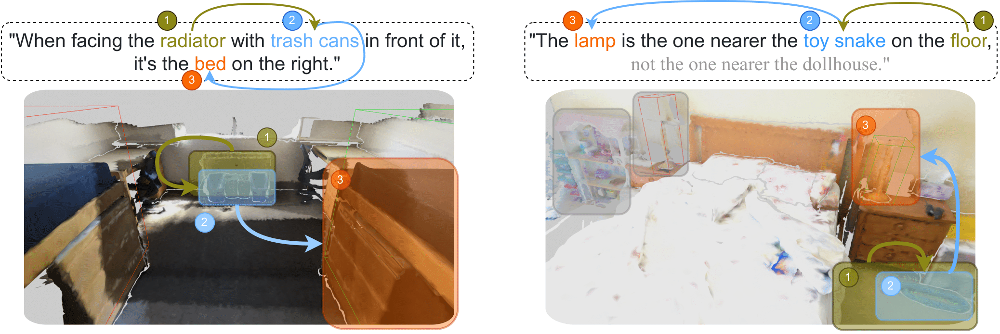
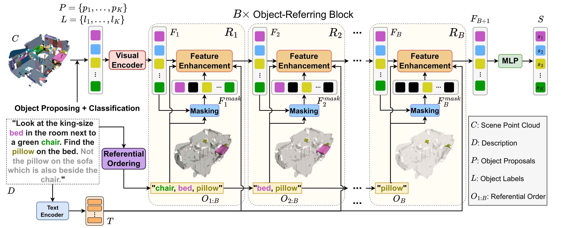

Official code of the paper [Data-Efficient 3D Visual Grounding via Order-Aware Referring](https://arxiv.org/abs/2403.16539)

## News
- (Oct. 2024) The paper has been accepted to the WACV'25.

## Overview
This paper presents a data-efficient 3D visual grounding framework, Vigor, which leverages the LLMs to exploit the referential order in a zero-shot manner. The extracted referential order points from the anchor objects to the target object and helps Vigor gradually locate the correct target object through customized transformer layers. We further propose a simple yet effective order-aware warm-up method to pre-train the model. The warm-up method and the referential order largely reduce needed point cloud-description pairs. Vigor surpasses many previous full-data methods using only 1% of training data.

  
   

