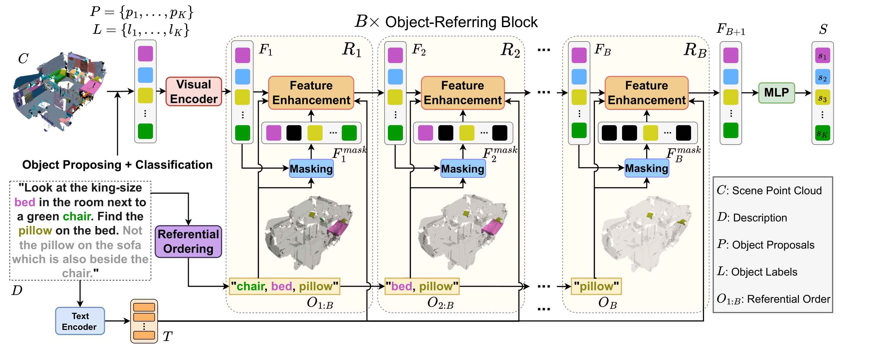

# Data-Efficient 3D Visual Grounding via Order-Aware Referring
Official code of the paper [Data-Efficient 3D Visual Grounding via Order-Aware Referring](https://arxiv.org/abs/2403.16539).

## News
- (Oct. 2024) The paper has been accepted to the WACV'25 as a main conference paper.

## Overview
This paper presents a data-efficient 3D visual grounding framework, Vigor, which leverages the referential order to achieve high grounding accuracy using only a small amount of point cloud-description pairs. Vigor utilizes the LLMs to exploit the referential order of a natural language description in a zero-shot manner. The extracted referential order points from the anchor objects to the target object and helps Vigor gradually locate the correct target object through customized transformer layers. We further propose a simple yet effective order-aware warm-up method to pre-train the model. The warm-up method and the referential order largely reduce needed point cloud-description pairs. Vigor surpasses many previous full-data methods using only 1% of training data.

<p float="left">
  
   
</p>

## Setup
```bash
conda create -n vigor python=3.6.9
conda activate vigor
conda install pytorch==1.10.1 torchvision==0.11.2 torchaudio==0.10.1 cudatoolkit=11.3 -c pytorch -c conda-forge
git clone https://github.com/tony10101105/Vigor.git
cd Vigor
pip install -e .
```
## Datasets
Please follow the data preparation of [referit3d](https://github.com/referit3d/referit3d).

We adopt bert-base-uncased from huggingface, which can be installed using pip as follows:
```bash
pip install transformers
```
## Warm-up
To warm-up the model as illustrated in our [paper](https://arxiv.org/abs/2403.16539):
```Console
    python train_referit3d_pre.py
    -scannet-file $PATH_OF_SCANNET_FILE$ \
    -referit3D-file $PATH_OF_REFERIT3D_FILE$ \
    --bert-pretrain-path 'bert-base-uncased' \
    --log-dir logs/Vigor \
    --n-workers 2 \
    --unit-sphere-norm True \
    --batch-size 24 \
    --encoder-layer-num 3 \
    --decoder-layer-num 4 \
    --decoder-nhead-num 12 \
    --gpu "0" \
    --view_number 4 \
    --rotate_number 4 \
    --label-lang-sup True \
    --multilabel-pretraining True \
    --cascading True \
    --order-len 4 \
    --inner-dim 1152 \
    --max-train-epochs 300
```

## Training
To train on either Nr3d or Sr3d dataset:
```Console
    python train_referit3d.py \
    -scannet-file $PATH_OF_SCANNET_FILE$ \
    -referit3D-file $PATH_OF_REFERIT3D_FILE$ \
    --resume-path $PATH_OF_WARMUPED_VIGOR$ \
    --bert-pretrain-path 'bert-base-uncased' \
    --log-dir logs/Vigor \
    --n-workers 2 \
    --unit-sphere-norm True \
    --batch-size 24 \
    --encoder-layer-num 3 \
    --decoder-layer-num 4 \
    --decoder-nhead-num 8 \
    --gpu "0" \
    --view_number 4 \
    --rotate_number 4 \
    --label-lang-sup True \
    --fine-tune True \
    --multilabel-pretraining True \
    --lang-multilabel True \
    --cascading True \
    --order-len 4
```

## Validation
After each epoch of the training, the program automatically evaluates the performance of the current model. The code saves the last model in the training as **last_model.pth**, and the best model as **best_model.pth**.

## Testing
To test on either Nr3d or Sr3d dataset:
```Console
    python referit3d/scripts/train_referit3d.py \
    --mode evaluate \
    -scannet-file $PATH_OF_SCANNET_FILE$ \
    -referit3D-file $PATH_OF_REFERIT3D_FILE$ \
    --resume-path $PATH_OF_WARMUPED_VIGOR$ \
    --bert-pretrain-path 'bert-base-uncased' \
    --log-dir logs/Vigor \
    --n-workers 2 \
    --unit-sphere-norm True \
    --batch-size 24 \
    --encoder-layer-num 3 \
    --decoder-layer-num 4 \
    --decoder-nhead-num 8 \
    --gpu "0" \
    --view_number 4 \
    --rotate_number 4 \
    --label-lang-sup True \
    --multilabel-pretraining True \
    --lang-multilabel True \
    --cascading True \
    --order-len 4 \
    --mode evaluate
```

## Citation
```
@article{wu2024dora,
  title={DOrA: 3D Visual Grounding with Order-Aware Referring},
  author={Wu, Tung-Yu and Huang, Sheng-Yu and Wang, Yu-Chiang Frank},
  journal={arXiv preprint arXiv:2403.16539},
  year={2024}
}
```

## Credits
Our code is mainly built on:
* [ReferIt3D](https://github.com/referit3d/referit3d)
* [MVT](https://github.com/sega-hsj/MVT-3DVG)
